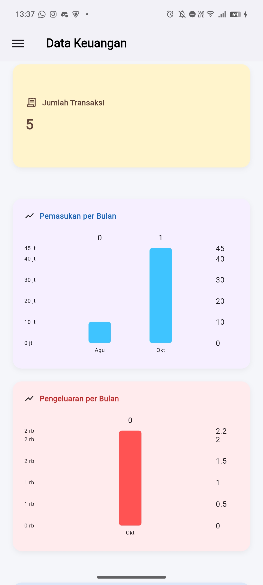
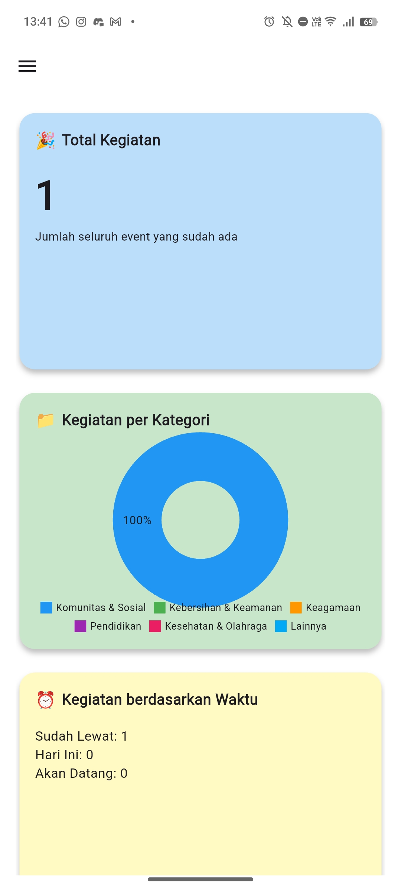
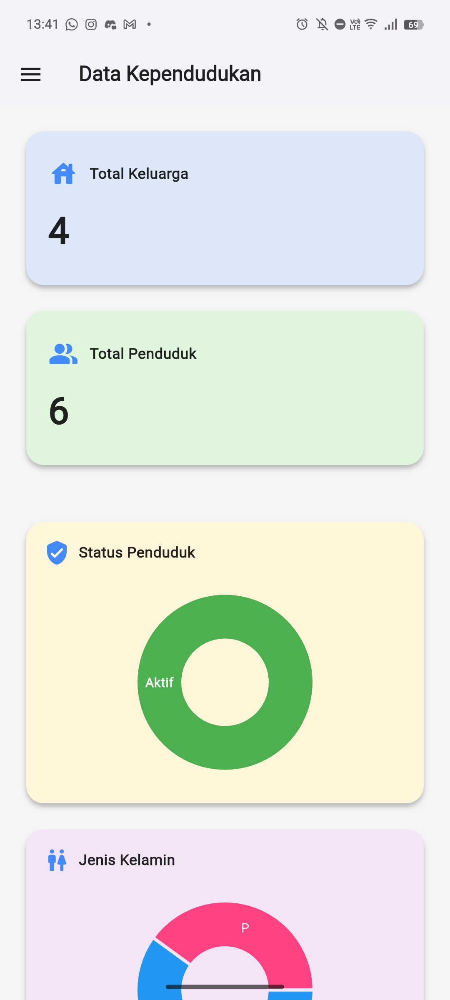

# Instalasi

**Requirements:**

<li> Flutter 3.35.2 atau lebih tinggi
<li> Dart 3.9.0 atau lebih tinggi
<li> ADB 1.0.41 atau lebih tinggi
<li> Android Debugging aktif

<br>

**Langkah Instalasi:**
<br>

1. Clone repository

```shell
git clone https://github.com/rockhubzz/Jawara
cd Jawara
```

2. Get Dependencies

```shell
flutter pub get
```

3. Run aplikasi di android fisik
   <br>
   a. Mode debug
   <br> 1. Sambungkan perangkat android ke PC dengan kabel USB
   <br> 2. Aktifkan USB Debugging pada android pada opsi pengembang
   <br> 3. Jalankan perintah berikut:

   ```shell
   adb devices
   ```

   Kemudian catat kode perangkat yang terdeteksi pada list

   ```shell
   List of devices attached
    10DE88061C000EC device
   ```

   Lalu jalankan perintah berikut dengan menambahkan kode perangkat sebelumnya:

   ```shell
    flutter run -d <kode perangkat>
   ```

   Contoh:

   ```shell
   flutter run -d 10DE88061C000EC
   ```

   <br> 4. Aplikasi siap digunakan pada perangkat android anda
   <br>

   b. Build APK
   <br> 1. Jalankan perintah berikut

   ```shell
    flutter build apk
   ```

   <br> 2. Setelah proses building selesai, file .apk dapat ditemukan pada direktori berikut:

   ```
   Jawara/build/app/outputs/flutter-apk/<nama-file-apk>.apk
   ```

   <br> 3. Salin file .apk ke perangkat android lalu instal. Berikan izin instalasi dari sumber tidak diketahui jika diminta

<br>

# Demo

**Screenshots:**
<br> Dashboard Data Keuangan:

<br> Dashboard Data Kegiatan:

<br> Dashboard Data Kependudukan:


**Demo Video:**

<video src="assets/demos/demo_video.mp4" controls width="600">
  Your browser does not support the video tag.
</video>
